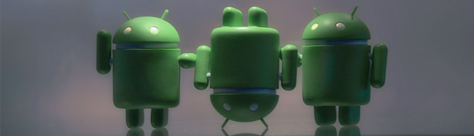

Yesterday, Google announced their new messaging app (after several previous attempts and failures in the space) [Allo](https://googleblog.blogspot.com/2016/05/allo-duo-apps-messaging-video.html) (pronounced Aloe). I'm going to spare you the circlejerk the tech media world has had over the "groundbreaking tech" and just go over the ways Google fucked up.

###Incognito Mode

One of Google's big features for Allo is the inclusion of an end to end encrypted "incognito mode." The encryption for this is provided in partnership with Open Whisper System's [signal protocol](https://whispersystems.org/blog/allo/) which is considered the state of the art for encrypted mobile messaging (and can be found in WhatsApp and OWS's own Signal application). This is big news coming from Google who has historically been anti encryption (as it prevents them from scanning your data for analysis, profiling, and later advertising). Of course, it's not nearly as exciting as it seems at first glance.

Incognito mode is opt-in, meaning you have to go out of your way to initialize an incognito chat with a contact. This is as good as useless when it comes to defeating mass surveillance and may even be harmful for targeted surveillance. The single greatest tool we have to rely on in defeating wide scale, "suck-it-all-up" data collection is mass encryption. That means encrypting every single piece of information that goes from one party to another. The more encryption, and the more sources that that encryption is coming from, the more useless mass surveillance becomes. In an ideal scenario, this means government agencies will no longer be able to find likely targets *just* because they use encryption, instead being forced to rely on old fashioned police work. Tools like WhatsApp (and to a much lesser extent Signal) are invaluable for this goal by *forcing* users to encrypt every single message - billions and billions of them every single day.

But Allo doesn't do this. Instead, Allo's default setting not only sends your messages in plain text (though admittedly, they are encrypted over the wire), but advertises *scanning your texts and photos and uploading the data to Google's cloud as a feature*. This is coming from the company who's previous messaging app had [wiretapping for LEO built in](http://motherboard.vice.com/read/google-confirms-cops-can-wiretap-your-hangouts). Even worse, if you do choose to encrypt your Allo messages, the fact that you have to opt-in to this setting makes you stand out as a user who took that extra step - very suspicious looking to automated threat rankings like [XKeycore](https://en.wikipedia.org/wiki/XKeyscore).

###The Virtual Assistant

All that aside, according to Google PR, the "killer" feature of the app is it's AI assistant which Google explains as "deeply integrated machine learning, Allo has smart features to keep your conversations flowing and help you get things done." Lots of marketing speak, but this is quickly grasped by looking at their example:

To briefly breakdown what's going on here, Allo uploads every text you make, every text you receive, and every image that comes through the app and combines it with information gathered from your GMail and the sites you browse across the internet to create a cloud based AI to help you, uh, "message" I guess (if an automatic "Love the Daisy!" reply counts). If that sounds vapid, well read Google's explanation:

> *For example, it will learn whether you’re more of a “haha” vs. “lol” kind of person. The more you use Allo the more “you” the suggestions will become. Smart Reply also works with photos, providing intelligent suggestions related to the content of the photo. If your friend sends you a photo of tacos, for example, you may see Smart Reply suggestions like “yummy” or “I love tacos.”*

Welcome to 2016, where the second most valuable company in the world developed an AI that can automatically respond to picture messages with "I love tacos."

Obviously Google is hoping you can't live without autogenerated "I love tacos" replies and will use Allo in it's normal operating mode (not incognito mode where end-to-end encryption means Google can't scan your messages). The additional data you provide through submitting all of your messaging through their services are hugely valuable to a) target ads to you and b) improve their learning algorithms to target ads better to everyone else.

Let's look at the transaction going on here. In exchange for surrendering most (if not all) your personal communications to Google's servers, you get automatic, customized suggestions of "lol" instead of a default "haha."

lol

Granted, there are other features the app has such as integrated searches, maps, YouTube, or sports scores. But the problem here is that this app isn't actually solving any problem. It's not hard for me to switch an app and check a score, it isn't difficult for me to look at a picture of a kid with a flower and write a three word response. So what's the point?

I fail to see why Google feels we need to take human conversations and automate them with learning AI. Instant messaging is already a low involvement media. It's just not difficult to respond to messages in just a few words. The idea that we need machine learning to automate this is ridiculous considering what is basically zero time saved. The ultimate end to this line of thinking, of course, is bots having conversations with other bots while their human "personalities" watch them pretend to be people (I'm certain with a week of launch we'll see videos of just bots chatting with eachother).

So the final equation here is: *there is almost no value gained for users, Google gets **tons** of additional data, and privacy is an opt-in option shoved into a submenu somewhere.* Truly, we live in a time of stunning tech innovation. But then again, considering the total lack of privacy concern and blind Google devotion I see in vocal Android users (full disclosure, I use Android), I won't be surprised when this catches on.

***

Photo by [Brendan Lim](https://www.flickr.com/photos/brendanlim/) released under CC.
