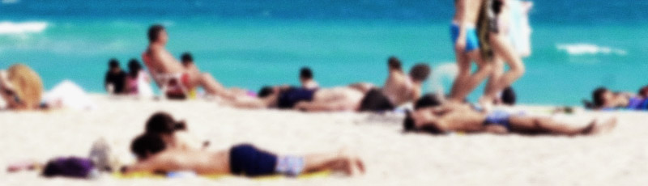

It sounds like a dream come true for tourism boards. A potential tourists sees an ad, clicks on a banner, likes a Facebook page, or visits your domain on their mobile device and ends up with a unique ID that can be remotely tracked in the real world once they arrive in your town. Your advertising can be instantly measured and analyzed by looking at when potential tourists saw/visited your ads and website, how frequently, how long, and from where all the way to when they pull up to your physical beach. This is the tech behind [Arrivalist](http://www.arrivalist.com/index.html) which the city of Myrtle Beach has just deployed.

Every time you visit a website, unless you run intrusive and often painful privacy-centric blocking addons (like I do), you're allowing someone to load tracking information (cookies) onto your devices. This is common and a large part of how advertising on the web works.

What separates Arrivalist and Myrtle Beach from simple (but invasive) online tracking is using those unique identifiers to follow people into the real world. Look at this example page from the Arrivalist analytics suite:

Using phone geo-data and the cookies already stored on that device, you can literally watch people travel from their home to your destination. If you don't find that creepy then you've sold out.

Now Arrivalist and Myrtle Beach Tourism Board are quick to point out that their tracking is anonymous with CEO Cree Lawson explaining "We have absolutely no idea who these people are. All we know is that their computing device, which is recorded to an anonymous ID, was recorded hundreds of miles away and showed up within the market." While a nice story and certainly adequate to ease the fears of investors and news reporters, the fact is "anonymized" data is trivial to [deanonymize](http://www.nature.com/articles/srep01376) - especially when location data is recorded (which is Arrivalist's bread and butter).

Cree Lawsone shows his disdain for those concerned with the massive breach of privacy by quipping "Our technology is based on cookies because everybody knows cookies. Everybody who is focused on privacy knows how to turn them off." While it's true you can simple turn off cookies, you'll quickly find your internet browsing experience is almost impossible.

We shouldn't be forced to choose between protecting our privacy and having a usable web and while there are plugins that can automatically block just the "bad" cookies, the idea that we live in a world where he have to actively opt-out of tracking *which we frequently don't even realize is occurring in the first place* (how many spring breakers do you think realize their phone's location is reporting to Myrtle Beach tourism board?). If you don't have the technical chops to understand that this sort of invasion of privacy is possible much less commercialized and common, why does that make your privacy not worth respecting?

Combine all this with the city's [800 camera surveillance project](http://www.myrtlebeachonline.com/news/local/article74243032.html) which has just completed and you've got the perfect recipe for a surveillance spring break.

Thanks to [WMBF](http://www.wmbfnews.com/story/31958738/new-program-tracks-myrtle-beach-tourist-data-through-mobile-devices) and David Hucks at [MyrtleBeachSC](http://www.myrtlebeachsc.com/spying-tourists-2016/) for bringing this to wider attention.

***

Photo by [Gubatron](https://www.flickr.com/photos/gubatron/) and released under CC BY-NC-SA
